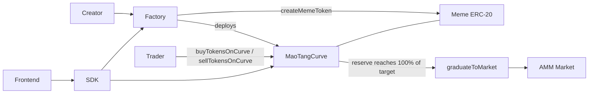
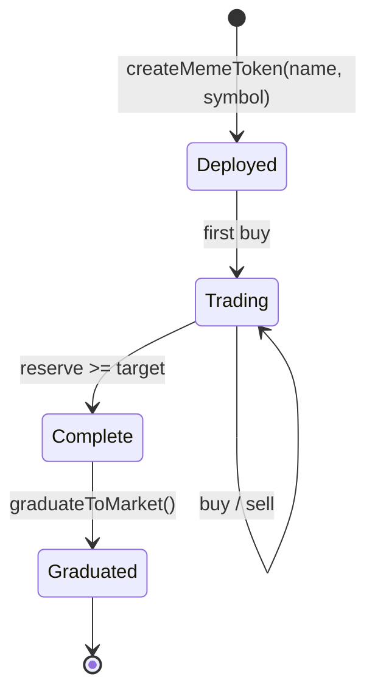

# MAOTANG Protocol — Architecture Specification

Status: scaffold (v0.1). Curve constants in this document are the reference values used by
`sdk/src/curve-math.ts` and must be re-confirmed before mainnet deployment.

## 1. Purpose

MAOTANG (猫糖) is a meme-first DEX. Instead of opening every new token into an empty order book,
each launch starts on its own deterministic bonding curve. The curve provides a price for any
trade size from the first block, and hands the accumulated liquidity to an open market once the
launch has proven demand.

Design goals:

- **One-click launches** — a creator supplies only a name and a symbol.
- **Always-liquid curves** — buys and sells settle against the curve, never against a counterparty.
- **Deterministic graduation** — liquidity migration is triggered by the curve reaching 100% of a
  fixed raise target, not by an admin decision.
- **Permissionless graduation** — any account can trigger the migration; nobody can block it.

## 2. System overview



## 3. Components

| Component | Interface | Responsibility |
| --- | --- | --- |
| Factory | `IMaoTangFactory` | Validates metadata, deploys the meme ERC-20 and its curve, indexes launches. |
| Curve | `IMaoTangCurve` | Holds reserve + inventory, prices trades, enforces the raise target. |
| Graduation | `IMaoTangGraduate` | Migrates reserve and remaining inventory into a market once the target is met. |
| Meme ERC-20 | — | Standard 18-decimal token minted by the curve during buys. |

The reference implementation is a single `MaoTangCurve` deployment per launch that implements both
`IMaoTangCurve` and `IMaoTangGraduate`, so `graduateToMarket()` is called on the curve address
itself. Splitting graduation into a shared router later only requires changing the address the SDK
targets.

## 4. Curve model

The curve uses a constant-product invariant over **virtual** reserves, which gives a finite starting
price without requiring the creator to seed liquidity:

```
invariant k = (R + Rv) * (S + Sv)
```

- `R` — real reserve held by the curve, in wei
- `S` — meme tokens sold by the curve, in 18-decimal units
- `Rv` — virtual reserve (`VIRTUAL_RESERVE_WEI`)
- `Sv` — virtual token inventory (`VIRTUAL_TOKEN_SUPPLY`)

Spot price, returned by `calculatePrice()` as reserve wei per whole token:

```
price = (R + Rv) * 1e18 / (S + Sv)
```

Buy `reserveIn` (paid as `msg.value`):

```
fee            = reserveIn * FEE_BPS / 10000
net            = reserveIn - fee
tokensOut      = (S + Sv) - k / (R + Rv + net)
```

Sell `tokensIn` (the curve must be pre-approved for the token):

```
grossReserveOut = k / (S + Sv - tokensIn) - (R + Rv)
fee             = grossReserveOut * FEE_BPS / 10000
reserveOut      = grossReserveOut - fee
```

Integer division always truncates in favour of the curve, so the invariant cannot drift against the
pool. The off-chain mirror in `sdk/src/curve-math.ts` implements exactly these formulas so the
frontend can quote before submitting a transaction.

### Reference constants

| Constant | Value | Note |
| --- | --- | --- |
| `VIRTUAL_RESERVE_WEI` | 30 ETH | Sets the starting price floor. |
| `VIRTUAL_TOKEN_SUPPLY` | 1,073,000,000 tokens | Virtual inventory. |
| `GRADUATION_TARGET_WEI` | 5 ETH | Real reserve that triggers graduation. |
| `TRADE_FEE_BPS` | 50 (0.50%) | Swap fee, per Whitepaper v2.2. Split policy still open; defaults to the sustenance vault. |
| `GRADUATION_FEE_BPS` | 100 (1.00%) | Charged on reserve migrated at graduation, per Whitepaper v2.2. |

## 5. Lifecycle



1. **Deployed** — factory creates the ERC-20 and the curve, emits `MemeTokenCreated`.
2. **Trading** — `buyTokensOnCurve` / `sellTokensOnCurve` move the price along the curve.
3. **Complete** — the real reserve reaches 100% of `target()`; `graduationProgressBps()` returns 10000.
4. **Graduated** — reserve and unsold inventory move to the market; curve trading reverts with
   `CurveAlreadyGraduated`.

## 6. Frontend

`frontend/` is a Next.js App Router application (TypeScript, Tailwind CSS v4).

- `src/app/page.tsx` — launch board and the create-token panel.
- `src/lib/launches.ts` — shape of a launch card; currently populated with placeholder data.
- The SDK is consumed as a local workspace dependency (`file:../sdk`) and must be built before
  `next dev` / `next build` resolves it.

Once the factory is deployed, replace the placeholder board with
`MaoTangClient.getCurveState(curve)` calls and drive the create panel through
`MaoTangClient.createMemeToken({ name, symbol })`.

## 7. SDK

`sdk/` is dependency-free TypeScript. It never signs or ABI-encodes on its own; the host supplies a
`ContractTransport`, which keeps the package usable from viem, ethers, a wallet bridge, or a test
double.

```ts
import { MaoTangClient, type ContractTransport } from "@maotang/sdk";
import { createPublicClient, createWalletClient, custom, http } from "viem";

const transport: ContractTransport = {
  getChainId: () => publicClient.getChainId(),
  getAccount: async () => walletClient.getAccount()?.address,
  getBalance: (address) => publicClient.getBalance({ address }),
  read: ({ address, abi, functionName, args }) =>
    publicClient.readContract({ address, abi, functionName, args } as never),
  write: ({ address, abi, functionName, args, value }) =>
    walletClient.writeContract({ address, abi, functionName, args, value } as never),
  waitForReceipt: async (hash) => {
    const receipt = await publicClient.waitForTransactionReceipt({ hash });
    return { status: receipt.status };
  },
};

const client = new MaoTangClient({
  factory: "0x...",
  chainId: 8453,
  transport,
});

const state = await client.getCurveState("0x...");
```

Exports:

- `MaoTangClient` — protocol entry point.
- `maoTangFactoryAbi`, `maoTangCurveAbi`, `maoTangGraduateAbi` — minimal human-readable ABIs.
- `priceAt`, `quoteBuy`, `quoteSell`, `graduationProgressBps`, `isGraduated` — off-chain curve math.

## 8. Security considerations

- **Rounding** — all divisions truncate toward the curve; buys and sells must never leak value.
- **Reentrancy** — reserve transfers happen after curve state is written, guarded against reentry.
- **Slippage** — the parameterless curve entry points carry no user bounds; callers must quote first
  and enforce their own minimum-out / maximum-in before submitting.
- **Graduation front-running** — a curve that has reached its target must not be tradable; trading
  reverts once `graduateToMarket()` has run.
- **Metadata abuse** — empty names or symbols are rejected; duplicate symbols are rejected by the
  factory.
- **Fee policy** — the 1% split between protocol treasury and creator is unresolved and must be
  fixed before audit.

## 9. Open questions

1. Reserve asset: native ETH only, or an allow-list of ERC-20 quote assets?
2. Market design at graduation: a fixed AMM pair, or a configurable venue adapter?
3. Creator fee share and vesting for the un-graduated token inventory.
4. Anti-snipe mechanics during the first blocks of a curve.
## 10. AI-agent native authentication

Humans do not touch the protocol directly: every claim and every curve trade is executed by a
registered personal AI agent.

- `AIAgentRegistry.registerAgent(agentPubKey, hardwareProof, hardwareNullifier)` verifies a Groth16
  hardware-attestation proof (`IZKVerifier.verifyProof`) and binds one agent to one hardware nullifier.
  The agent identity address is derived deterministically from its public key
  (`agentAddress(agentPubKey)`), and the caller becomes the human owner the agent acts for.
- `HumanToken.claimHumanQuota(proof, nullifierHash)` verifies the personhood proof against the same
  verifier before minting one quota; `requireAuthorizedAgent(agent)` stays the single gate, and curve and
  market entry points inherit `AgentGated` so DEX trades carry the same requirement.
- One public key and one hardware nullifier can each be bound once, one nullifier can consume its quota
  once, and the human owner can revoke an agent at any time.
- The verifier (`contracts/src/Groth16Verifier.sol`) hardcodes no key: verification fails closed until the
  owner installs the ceremony key, and `lockVerificationKey()` then freezes it irreversibly.

The agent SDK performs the A2A handshake (`AgentClient.agentLogin()`): it derives the agent address,
checks the on-chain registration, requires the connected account to be the agent and verifies a signed
challenge before any intent runs. `AgentClient.executeIntent(intent)` then maps natural language
("claim my quota", "swap 0.5 ETH for mHUMAN") onto `claimHumanQuota`, `buyTokensOnCurve` and
`sellTokensOnCurve`, and `getAgentBalance()` reports the human's `$mHUMAN` balance plus the curve
liquidity position.


## 11. Local SLM agent engine

The agent runtime is local-first: intent parsing must not depend on any cloud LLM.

- `agent-client/src/slm/` wraps `llama.cpp` (`node-llama-cpp`, GGUF) and ONNX Runtime
  (`onnxruntime-node`, INT4 ONNX) behind one `SlmEngine` interface. Both native modules are optional
  dependencies loaded through a dynamic import, so the package builds and tests without them.
- The default model is Qwen2.5-0.5B-Instruct INT4 (~397 MiB of weights). A resident-memory estimate
  adds the fp16 KV cache (`2 * layers * kv_heads * head_dim * 2 * context`) plus runtime overhead and
  enforces a 500 MiB ceiling; larger models are refused unless `allowOverBudget` is set on purpose.
- The runtime is local-only by construction: `assertNoCloudDependencies()` rejects any endpoint,
  base URL, API key or token field, and `mode: "native"` fails loudly instead of degrading to the
  simulated engine.
- `agent-client/src/intents/` defines the two strict JSON-Schema tools - `claim_mhuman_quota` and
  `swap_micro_human` - and renders a ChatML system prompt that instructs the model to emit exactly one
  tool call. `parseToolCall()` extracts the JSON, rejects unknown tools and validates every argument
  before a call can reach a wallet.
- `agent-client/test/local-agent.test.ts` drives the full pipeline in `simulated` mode (a deterministic
  stand-in for the model) so tool calling is covered in CI, and verifies the native path fails loudly
  when its runtime is absent.

## 12. DePIN mining engine

Registered agents turn local physical and compute work into `$mHUMAN` rewards. `MaoTangMining`
(`contracts/src/MaoTangMining.sol`) inherits `AgentGated`, so every entry point carries the same
`requireAuthorizedAgent` gate as token claims.

- `submitMiningProof(bytes32 proofType, bytes proofData)` accepts exactly two proof types, both a
  fixed 192-byte (six ABI words) blob:
  - `PROOF_TYPE_BLE_PING` (ASCII `maotang.mining.ble-ping.v1`) - a batch of BLE proximity
    observations: ping count, strongest RSSI, window start/end, beacon-set hash and the node-signed
    telemetry digest. Rejected when the strongest signal is outside -100..-20 dBm, the window is
    stale (older than 15 minutes) or in the future, the batch is empty/oversized, or a digest is
    missing.
  - `PROOF_TYPE_ZK_COMPUTE` (ASCII `maotang.mining.zk-compute.v1`) - a batch of offloaded NPU tasks:
    task count, attested compute units, window, task-set hash and the ZK proof digest. Rejected when
    the attested work is below `MIN_COMPUTE_UNITS` or the batch is empty/oversized.
- Each proof is scored once: the nullifier `keccak256(abi.encode(proofType, agent, proofData))` is
  written before accrual, so replaying identical bytes reverts with `ReplayProof`.
- Rewards accrue in `pendingMiningRewards[agent]` and are subject to a hard per-epoch emission cap
  (`MAX_EPOCH_REWARD`, one human quota per day). `claimMiningRewards()` transfers the accrued
  micro-units out of the contract's reward vault to the agent's own contract account; the vault is
  funded with `fundRewardVault` (`transferFrom`), never minted, so mining cannot dilute holders.

The off-chain half lives in `agent-manager/src/mining/`:

- `constants.mjs` is the single source of truth for every value shared with the contract (proof-type
  tags, reward rates, proximity band, batch bounds, emission cap) plus the precomputed function
  selectors; `test/mining_e2e.py` re-derives each selector with a vector-checked keccak256 and
  asserts the Solidity and JS constants are equal, so the two sides cannot drift.
- `abi.mjs` is a minimal, dependency-free encoder for the two fixed payloads and the
  `submitMiningProof` / `claimMiningRewards` / `fundRewardVault` calldata.
- `telemetry.mjs` normalizes raw BLE observations and NPU task results, drops out-of-band/stale
  duplicates, commits the set with SHA-256 and signs the batch with the node's Ed25519 key.
- `transport.mjs` builds, signs (via an injected TEE/Secure-Enclave signer) and broadcasts
  transactions over `eth_sendRawTransaction`, always through the fail-closed egress guard.
- `background-miner.mjs` is the ultra-low-power worker: a single `unref()`ed duty-cycle timer, newest
  N items per proof, NPU batching paused below a battery floor unless charging, local de-duplication
  and a pre-check against the epoch cap.

`python test/mining_e2e.py` is the runnable evidence: it verifies the shipped sources, checks the
constant/selector agreement, then simulates BLE pings and NPU tasks through a mirror of the
contract's rules to show exact reward accrual, vault disbursement and every rejection path.

## 13. Multi-node DePIN topology (Phase P3)

Phase P1 made one machine a miner and Phase P2 made it a renderer. Phase P3 makes a fleet of those
machines addressable: every node advertises what it can actually do, and the hub routes work to a node
that can do it. The unit of advertising is a signed hardware heartbeat.

```text
                      +----------------------------------------------+
                      |          Orchestrator (off chain)            |
                      |  routing table: agent -> capability, sequence |
                      +---^--------^--------------^-------------^----+
     POST /telemetry/heartbeat |        |              |             |
                      +-------+--+ +---+------+ +-----+------+ +----+------+
                      | RENDER   | | SLM      | | NPU / ZK   | | BLE / UWB |
                      | NODE     | | NODE     | | NODE       | | NODE      |
                      | RTX 3060 | | qwen2.5  | | Groth16    | | beacons   |
                      | NVENC    | | 0.5B i4  | | prover     | | proximity |
                      +----+-----+ +----+-----+ +-----+------+ +-----+-----+
                           |            |             |              |
                           +------------+------+------+--------------+
                                               | signed capability + work proofs
                                      +--------v---------+
                                      | MaoTangMining    |  $mHUMAN rewards
                                      | (AgentGated)     |  BLE + NPU proof types
                                      +------------------+
```

| Node role | Advertised capability | Consumer of the capability |
| --- | --- | --- |
| Render node | GPU name, VRAM, probed NVENC availability, FFmpeg path | Video Factory v2 job routing |
| SLM node | Model fingerprint (SHA-256 of the weights), CPU class, RAM | Local inference offload |
| NPU / ZK node | GPU + Node runtime, so the hub can size proof batches | `MaoTangMining` proof scoring |
| BLE / UWB node | Node runtime and platform only; coverage is a proof, not a capability | `MaoTangMining` proximity proofs |

### 13.1 The heartbeat

`agent-client/src/telemetry.ts` owns this. A collector probes the machine, canonicalizes the result,
hashes it and signs the digest:

```text
HardwareProfile   = nodeVersion, platform, arch, cpuModel, cpuCount, memoryBytes,
                    gpus[{ vendor, name, vramBytes, nvencCapable, source }],
                    nvenc (probed, never assumed), ffmpegPath,
                    slm { id, path, available, bytes, sha256 }

TelemetryEnvelope = { proofType, agent, sequence, timestamp, hardware }
digest            = sha256("maotang-node-telemetry-v1" + "\n" + canonicalize(envelope))
signature         = secp256k1 ECDSA over sha256(digest), DER-encoded
```

- `proofType` is the ASCII tag `maotang.telemetry.node.v1` right-padded to 32 bytes, mirroring the
  `MaoTangMining` proof-type convention so the tag can be promoted to a real on-chain proof type
  without a rename.
- Canonicalization is the same function `video-worker.ts` uses for content proofs, so two independent
  implementations cannot disagree about the bytes behind a hash.
- `nvenc` is capability-probed by running `ffmpeg -hide_banner -encoders` and looking for `h264_nvenc`,
  the same check, the same `FFMPEG_DISABLE_NVENC` opt-out and the same binary resolution order as
  `video-factory/src/tooling.ts`. A node that does not list the encoder must not claim it.
- `slm.sha256` is a streaming SHA-256 of the local weights file. When nothing is configured, or the
  file is missing, the fingerprint reports `available: false` instead of inventing a hash.
- `sequence` is a per-process monotonic counter. It is deliberately *not* incremented by a dry run, so
  a node cannot desynchronize the orchestrator by building a heartbeat it never sends.
- Signature scheme: raw ECDSA over the digest, verifiable with `verifyHeartbeat`. Note the honest
  limit - signature verification proves the worker that holds the node key produced the envelope; it
  does not prove which on-chain *address* did, because deriving an address from a public key needs
  keccak256, which is not in the Node standard library. The orchestrator records the configured agent
  address next to the signature and a keccak-capable verifier can close that loop later.

### 13.2 Transport and its current limit

The working transport is the off-chain orchestrator: `HardwareTelemetryCollector.sendHeartbeat()`
POSTs `{ proofType, heartbeat }` to `MAOTANG_HEARTBEAT_URL` (falling back to `MAOTANG_TELEMETRY_URL`).
A `log` transport exists for air-gapped nodes and for tests.

There is no on-chain transport yet, and this is a tracked gap rather than an oversight:
`MaoTangMining.submitMiningProof(bytes32,bytes)` accepts exactly the `PROOF_TYPE_BLE_PING` and
`PROOF_TYPE_ZK_COMPUTE` shapes and scores them for rewards. It has no capability-registration entry
point, so a heartbeat has nothing to write. Promoting the heartbeat to chain means a third proof type
with its own scoring rule - a separate reviewed change, not a silent extension of an existing one.

The heartbeat loop is fail-soft by design: a broadcast error is logged and the next tick is scheduled,
because a node that cannot reach the orchestrator must still render video. `start()` / `stop()` follow
the same shape as `VideoWorker`, and both install `SIGINT` / `SIGTERM` handlers in their CLI entry.

Environment keys read (names only): `MAOTANG_AGENT_ID`, `MAOTANG_WORKER_PRIVATE_KEY`,
`MAOTANG_HEARTBEAT_URL`, `MAOTANG_TELEMETRY_URL`, `MAOTANG_HEARTBEAT_MS`, `MAOTANG_SLM_MODEL`. The
worker key is deliberately its own variable and must be a dedicated node key: reusing the deployer key
means a leaked node key can drain the deployment account.

Evidence: `agent-client/test/telemetry.test.ts` covers the tag constant, every GPU parser, the NVENC
probe and its disable switch, the model fingerprint, signature round-trip and tamper rejection, and the
sequence invariant. `npm test` in `agent-client/` runs it alongside the video-worker suite.

## 14. Cross-chain sustenance routing (Phase P3)

Whitepaper v2.2 section 5.1 defines a single aggregation pool. That pool is the hub,
`MaoTangSustenanceVault`, on the settlement chain. Phase P3 adds the other half of the topology:
secondary-L2 spokes that siphon the identical 0.5% swap and 1.00% graduation fees locally and flush
them to the hub. Moving every individual fee across chains would be uneconomic, so aggregation happens
per chain and only the flush is bridged.

Both halves are now implemented:

- The **spoke** (`contracts/src/SustenanceVaultSpoke.sol`) siphons, accounts for and flushes yield.
- The **hub intake** (`receiveBridgedYield` / `receiveBridgedYieldToken` on `MaoTangSustenanceVault`)
  accepts that flush, and only from an owner-trusted bridge adapter naming the spoke the owner
  registered for the origin chain.

```text
   Base / Arbitrum / Optimism (spoke)                  Settlement chain (hub)
   ----------------------------------                  ----------------------

   MaoTangBondingCurve --0.5%-->  SustenanceVaultSpoke      +-------------------------------+
                        --1.00%--> (per L2)                  | MaoTangSustenanceVault        |
                                        |                    |   remoteSpokes[chainId]       |
                     availableNative()  |                    |   trustedBridgeAdapters[a]    |
                  (siphoned - bridged)  |                    |   nativeFeesReceived          |
                                        v                    |   tokenFeesReceived[asset]    |
                        bridgeYieldToHub(adapter)            |   claimableSustenance[p][a]   |
                        bridgeYieldTokenToHub(...)           +---------------^---------------+
                                        |                                    |
                                        v                                    | intake, guarded by:
                        IBridgeAdapter (owner-allowlisted)                   |  - trusted adapter
                                        |                                    |  - registered pair
                                        +-- (originChainId, originSpoke) ----+     (chain, spoke)
```

### 14.1 Spoke surface

`contracts/src/SustenanceVaultSpoke.sol`, with `contracts/src/interfaces/IBridgeAdapter.sol` as the
only transport dependency:

| Member | Access | Purpose |
| --- | --- | --- |
| `receive()` / `depositFee(FeeSource)` | anyone | Siphons a native fee; `depositFee` attributes the stream. |
| `depositFeeToken(FeeSource, asset, amount)` | anyone | Siphons an ERC-20 fee via `transferFrom`. |
| `quoteFee(FeeSource, gross)` / `feeRateBps(FeeSource)` | anyone | Byte-compatible with the hub, so curve code is chain-agnostic. |
| `availableNative()` / `availableToken(asset)` | anyone | Siphoned minus bridged; the bridgeable balance. |
| `setKeeper(address, bool)` / `setBridgeAdapter(address, bool)` | owner | Administer keepers and allowlisted transports. |
| `bridgeYieldToHub(address adapter)` | owner or keeper | Flushes every accrued native fee to the hub vault. |
| `bridgeYieldTokenToHub(address adapter, asset, amount)` | owner or keeper | Flushes a bounded ERC-20 amount; approves the adapter, then clears the allowance. |

### 14.2 Hub intake surface

`contracts/src/MaoTangSustenanceVault.sol`:

| Member | Access | Purpose |
| --- | --- | --- |
| `remoteSpokes(uint256 chainId)` | anyone | Spoke registered for a chain; `address(0)` means none is. |
| `trustedBridgeAdapters(address adapter)` | anyone | Whether an adapter may deliver yield. |
| `setRemoteSpoke(uint256 chainId, address spoke)` | owner | Registers, rotates or revokes the spoke for a chain. |
| `setTrustedBridgeAdapter(address adapter, bool trusted)` | owner | Grants or revokes an adapter allowlisting. |
| `receiveBridgedYield(uint256 originChainId, address originSpoke)` | trusted adapter | Attributes native yield to its origin chain and adds it to `nativeFeesReceived`. |
| `receiveBridgedYieldToken(uint256 originChainId, address originSpoke, address token, uint256 amount)` | trusted adapter | Pulls ERC-20 yield in via `transferFrom` and adds it to `tokenFeesReceived[token]`. |

Events: `RemoteSpokeSet(chainId, spoke)`, `TrustedBridgeAdapterSet(adapter, trusted)` and
`BridgedYieldReceived(originChainId, originSpoke, bridge, amount, token)`.

What the intake guards do, and what they deliberately do not do:

- `receiveBridgedYield` reverts `UntrustedBridgeAdapter` for any caller the owner has not trusted,
  reverts `UnknownRemoteSpoke` when `(originChainId, originSpoke)` is not the registered pair (which
  also covers a zero `originSpoke` and a chain the owner has revoked), and reverts `ZeroAmount` on a
  zero-value delivery. The token variant adds the same `NATIVE` (`address(0)`) rejection that
  `depositFeeToken` uses.
- These guards protect **attribution, not solvency**. A plain native transfer is already accepted by
  the hub `receive()` and recorded as a Swap fee, so bridged ETH cannot be lost either way; what the
  guards add is provenance, so the settlement loop can tell an L2 flush apart from a direct donation.
  The token path is a genuine gate, because refusing to pull ERC-20 from an untrusted caller is
  exactly what the check prevents.
- Registration is a rotation-safe pair. `setRemoteSpoke` writes a single mapping slot, so there is no
  window in which two spokes are trusted for one chain, and `address(0)` revokes a chain outright.
- Delivered yield joins the same accounting as the single-chain streams, so `availableNative()`,
  `availableToken()` and `creditNativeSustenance` keep principal routing bounded by what the vault
  actually holds: a bridged deposit becomes routable, and nothing more than that.

Tests: `contracts/test/SustenanceVaultCrossChain.t.sol`, with `contracts/test/mocks/MockErc20.sol`,
covers owner-only administration, both rejection paths on both intakes, event emission, balance and
accounting updates, spoke and bridge revocation, that a bridge which has not approved cannot push
tokens, and that bridged yield becomes routable to a principal under the existing bounded-routing rule.

### 14.3 Invariants

- **Yield is never minted.** Every bridged amount is bounded by what was actually siphoned;
  `availableNative` and `availableToken` are received minus bridged, so they cannot go negative, and
  the hub records a delivery only up to the value it actually received.
- **The destination is fixed.** Both bridge functions always name `hubVault` on `hubChainId`. Neither
  the owner nor a keeper can redirect yield to an arbitrary address.
- **Adapters are allowlisted on both ends.** The spoke accepts a bridge adapter parameter but validates
  it against `bridgeAdapters`; the hub validates the delivering caller against
  `trustedBridgeAdapters`. Without the spoke check a compromised keeper could hand in a malicious
  adapter and sweep the balance; without the hub check any contract could claim provenance it does not
  have.
- **Relay fees stay separate.** `msg.value` on a bridge call is the transport fee, paid on top of the
  yield, so the bridged amount always equals the accounted amount and the hub can never be told it
  received more than was actually sent.
- **Checks-effects-interactions.** Bookkeeping is updated before any external call, so a reentrant
  bridge call finds nothing left to move.
- **No admin takeover.** Both `owner` fields are immutable, mirroring the hub, and no function lets an
  owner withdraw fees to itself.

### 14.4 Open items

- `contracts/scripts/deploy-testnet.ts` does not deploy a spoke yet. A spoke is per L2 and per adapter,
  so it belongs in a per-chain deployment entry point rather than the single-chain Alpha pipeline.
- No chain has a live adapter registration yet. `setRemoteSpoke` and `setTrustedBridgeAdapter` are
  owner transactions on the hub, so a chain goes live when its spoke has been deployed, allowlisted,
  and its transport adapter trusted.
- Fee rates are mirrored from `sdk/src/curve-math.ts`. Changing either side is a protocol-economic
  change and requires a superseding entry in `memory/ARCHITECTURE_DECISIONS.md`.

## 15. Yield drip and agent governance (Phase P4)

Phase P3 made the vault solvency-safe: fees aggregate per chain, flush to the hub, and are routed to a
principal only when the owner says so. Phase P4 answers the two questions that leaves open - how does a
holder actually receive yield without the owner adjudicating every claim, and who decides what the
protocol parameters are. Two contracts answer them:

- `contracts/src/MaoTangSustenanceDripper.sol` pays a holder directly out of a budget the vault owner
  released, against a signed hardware-telemetry attestation.
- `contracts/src/MaoTangGovernor.sol` replaces unilateral parameter changes with a proposal / vote /
  execute lifecycle weighted by `$mHUMAN`.

```text
   hardware telemetry (agent-client)             $mHUMAN holder
           |                                          |
           | sign(weight, window)                     | claimDripYield(weight, signature)
           v                                          v
   +------------------------------------------------------------------+
   | MaoTangSustenanceDripper                                         |
   |   telemetrySigner      claimCooldown      weightRate/balanceRate |
   +--------------------------------+---------------------------------+
                                    | withdrawDripAllowance(to, amount, asset)   [onlyDripper]
                                    v
   +------------------------------------------------------------------+
   | MaoTangSustenanceVault                                           |
   |   nativeDripBudget / nativeDripPaid    tokenDripBudget/Paid      |
   |   unreservedNative() = availableNative() - unspentDripNative()   |
   +------------------------------------------------------------------+
```

### 15.1 Dripper math

```text
   payout = min(telemetryWeight * weightRate + mHumanBalance * balanceRate, maxDripPerClaim)
```

Both legs are linear and the cap is absolute, so the price of a claim is auditable from three stored
numbers and a holder can predict a payout before spending gas on it (`previewDrip` for native,
`previewDripToken` per ERC-20). The shipped defaults are:

| Parameter | Default | Meaning |
| --- | --- | --- |
| `weightRate` | `1e9` wei | Paid per unit of attested telemetry weight. |
| `balanceRate` | `1e3` wei | Paid per `$mHUMAN` micro-unit held. |
| `maxDripPerClaim` | `0.01 ether` | Absolute ceiling on one native claim. |
| `minHumanBalance` | `1_000_000` micro-units | Holder floor: one whole `$mHUMAN` (the token has 6 decimals). |
| `minDripAmount` | `1e12` | Dust floor; a payout below it reverts rather than costing more gas than it pays. |
| `claimCooldown` | `1 days` | Minimum gap between two claims by the same account, bounded to `[1 hours, 30 days]`. |

A holder carrying one full personhood quota has a balance leg of `1e12 * 1e3 = 1e15` wei, so the
balance term alone is 0.001 ETH and the weight term reaches the cap at `telemetryWeight = 9e6`. The
floor exists because a payout that is cheaper than its own gas is a griefing surface rather than a
subsidy, and every knob above is owner-tunable (`setDripRates`, `setTokenDripRates`,
`setClaimGuardrails`, `setClaimCooldown`) within the documented bounds.

Three independent bounds keep an autonomous payout from becoming an autonomous drain:

1. **Cooldown.** One claim per account per `claimCooldown`, so a valid attestation cannot be replayed
   into a stream. `canClaim(account)` exposes the window without spending gas.
2. **Windowed signature.** The digest binds `block.timestamp / claimCooldown`, so an attestation
   expires by itself when the window rolls over instead of relying on a nullifier table.
3. **Vault budget.** The dripper can only ever move what the vault owner reserved through
   `fundDripBudget` / `fundDripBudgetToken`, so a compromise of the telemetry signer is bounded by
   that budget rather than by the vault balance.

### 15.2 Signature wire format

```text
   digest = sha256(abi.encode(CLAIM_DOMAIN, chainid, address(this), account, telemetryWeight, window))
   window = block.timestamp / claimCooldown
   CLAIM_DOMAIN = keccak256("maotang.drip.claim.v1")
```

Verification is `ecrecover` over the SHA-256 digest directly, which is why the off-chain producer has to
emit a flat signature: Node `crypto` does that with `dsaEncoding: "ieee-p1363"`, while the DER encoding
it produces by default is not accepted. Two flat forms are supported:

- **65 bytes**, `r || s || v`, with `v` accepted as 27/28 or normalised from 0/1.
- **64 bytes**, `r || s` (IEEEP1363), which omits the recovery id. Both candidates recover a valid
  address for a given `(r, s)`, so the attestation is accepted when either one is the configured signer.

Signatures with `s` above half the secp256k1 group order are rejected as malleable, and any other
length reverts `InvalidSignatureLength`. The digest binds chain id and contract address, so an
attestation cannot be replayed against a different deployment or a forked chain. The signer is
rotatable through `setTelemetrySigner`, and `verifyTelemetrySignature` is exposed so an orchestrator can
validate a vector before spending gas on a transaction.

### 15.3 Budget accounting

`MaoTangSustenanceVault` grew a reservation layer for the dripper:

| Member | Access | Purpose |
| --- | --- | --- |
| `setDripper(address)` | owner | Names the only contract allowed to draw the drip budget. Zero is rejected. |
| `fundDripBudget(uint256)` / `fundDripBudgetToken(address, uint256)` | owner | Reserves part of the already-received fees; moves no value. |
| `reclaimDripBudget(uint256)` / `reclaimDripBudgetToken(address, uint256)` | owner | Takes unspent budget back. |
| `unspentDripNative()` / `unspentDripToken(address)` | anyone | Reserved minus already paid. |
| `unreservedNative()` / `unreservedToken(address)` | anyone | What `creditNativeSustenance` / `creditTokenSustenance` may route. |
| `withdrawDripAllowance(address to, uint256 amount, address asset)` | dripper | Pays a claimant, bounded by the unspent budget. |

Events: `DripperSet`, `DripBudgetFunded`, `DripBudgetReclaimed` and `DripAllowanceWithdrawn(dripper, to,
asset, amount)`. Errors: `NotDripper`, `InvalidDripper`, `DripBudgetExceeded(asset, requested, unspent)`.

What the accounting guarantees:

- **The same wei is never promised twice.** `availableNative()` is received minus credited minus already
  dripped, and `unreservedNative()` is `availableNative() - unspentDripNative()`, so a reservation
  removes those fees from the creditable balance. Without the `nativeDripPaid` term a payout would stay
  visible as available and could be credited to a principal a second time.
- **Principal credit and the drip budget are mutually exclusive.** Reserving the whole unreserved
  balance makes `creditNativeSustenance` revert `InsufficientVaultBalance` for any amount.
- **The reservation is released by spending, not by decree.** `unreservedNative()` is invariant across
  drips: a payout lowers both `availableNative()` and `unspentDripNative()` by the same amount, so the
  remainder stays exactly as creditable as it was before the claim.
- **The budget, not the caller, is the bound.** A compromised dripper can drain the released budget and
  nothing more, and `withdrawDripAllowance` refuses any amount above the unspent remainder.
- **Checks-effects-interactions.** The dripper arms `lastClaimTimestamp` before calling the vault, so a
  reentrant claim finds the cooldown already active.

### 15.4 Governance lifecycle

```text
   propose  ->  Pending  ->  (votingDelay)  ->  Active  ->  (votingPeriod)  ->  Succeeded / Defeated
                                                                                     |
                                                                                 execute
                                                                                     v
                                                                                 Executed
```

`propose(targets, values, calldatas, description)` requires `proposalThreshold` voting power, and the
proposal id is `keccak256(chainid, address(this), targets, values, calldatas, description)`, so identical
contents can only ever exist once. `castVote(proposalId, support)` records a single receipt per voter
(0 against, 1 for, 2 abstain - the ordering Compound uses, so `0` is a real vote rather than the
uninitialised default). `execute(proposalId)` runs every call in order and reverts the whole proposal if
any call fails, which makes execution all-or-nothing rather than partially applied. A proposal succeeds
when it leads and the quorum of `quorumBps` of the `$mHUMAN` total supply has voted; abstentions count
toward quorum and not toward either side.

Voting weight is `mHuman.balanceOf(voter)` plus, when `nodePowerSource` is wired, whatever that contract
reports through `INodePowerSource`. That is what lets a human who also runs infrastructure carry more
weight than a single personhood quota.

Every parameter - `votingDelay`, `votingPeriod`, `proposalThreshold`, `quorumBps` and the node power
source itself - is changeable only through a passed proposal (`setVotingParams`, `setNodePowerSource`
revert `NotSelfGoverned` for any other caller), so the deployer cannot tighten or loosen the rules after
deployment. `votingDelay` is bounded to 30 days, `votingPeriod` to `[1 hours, 60 days]`, and `quorumBps`
to `(0, 10000]`.

**Known limitation.** Votes are read live at the moment of voting rather than from a snapshot, because
`HumanToken` implements no checkpoints, so a snapshot block would have to be fabricated. `$mHUMAN` is
transferable, so voting power can be acquired after a proposal opens. The follow-up is an ERC20Votes-style
checkpoint plus a `votingPowerAt(account, blockNumber)` read, after which the governor can snapshot at
`voteStart`; until then the mitigation is procedural - keep `votingDelay` long enough that a surprise
transfer cannot decide a vote.

### 15.5 Tests and open items

- `contracts/test/SustenanceDripper.t.sol` covers the drip math and its cap, the cooldown and its bounds,
  both signature encodings, wrong signer, mangled, high-s and truncated signatures, the claimant and
  weight bindings, the window rollover, the holder floor, the dust floor, the pause switch, the vault
  budget bound, the reserve-accounting invariant, the ERC-20 path, signer rotation and the owner-only
  surface.
- `contracts/test/MaoTangGovernor.t.sol` covers the full lifecycle, duplicate and empty proposals, the
  proposal threshold, vote windows and support guards, double voting, the quorum branch, execution
  rollback, both self-governance entry points, invalid self-governed parameters and the node power
  source.
- `contracts/scripts/deploy-testnet.ts` deploys both contracts and wires the vault to the dripper when
  the deployer is the owner. The drip budget is deliberately left unfunded: reserving it is an owner
  decision made once fees exist, not a deployment step.
- Open: no telemetry signer service is deployed yet, so `MaoTangSustenanceDripper.telemetrySigner`
  defaults to the owner as a stand-in until the orchestrator key exists.
- Open: the governor is deployed but owns nothing yet. Transferring authority over the vault, factory or
  verifier to it would be a separate, explicit ownership change.
