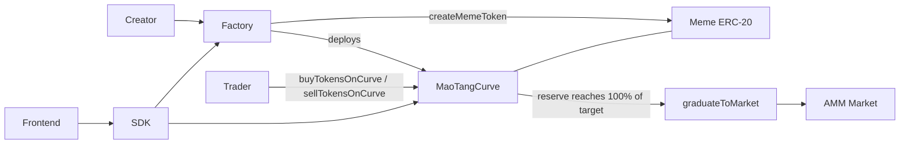
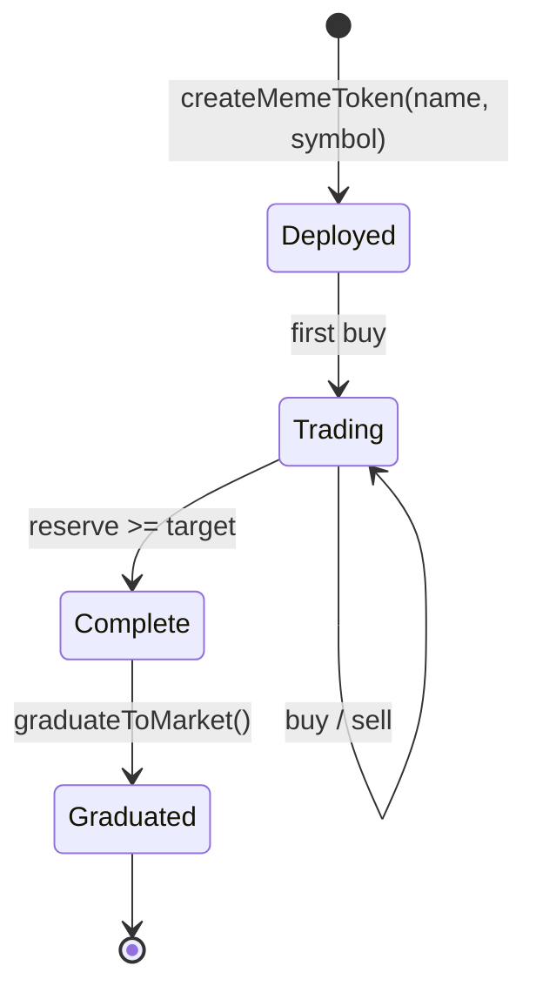

# MAOTANG Protocol — Architecture Specification

Status: scaffold (v0.1). Curve constants in this document are the reference values used by
`sdk/src/curve-math.ts` and must be re-confirmed before mainnet deployment.

## 1. Purpose

MAOTANG (猫糖) is a meme-first DEX. Instead of opening every new token into an empty order book,
each launch starts on its own deterministic bonding curve. The curve provides a price for any
trade size from the first block, and hands the accumulated liquidity to an open market once the
launch has proven demand.

Design goals:

- **One-click launches** — a creator supplies only a name and a symbol.
- **Always-liquid curves** — buys and sells settle against the curve, never against a counterparty.
- **Deterministic graduation** — liquidity migration is triggered by the curve reaching 100% of a
  fixed raise target, not by an admin decision.
- **Permissionless graduation** — any account can trigger the migration; nobody can block it.

## 2. System overview



## 3. Components

| Component | Interface | Responsibility |
| --- | --- | --- |
| Factory | `IMaoTangFactory` | Validates metadata, deploys the meme ERC-20 and its curve, indexes launches. |
| Curve | `IMaoTangCurve` | Holds reserve + inventory, prices trades, enforces the raise target. |
| Graduation | `IMaoTangGraduate` | Migrates reserve and remaining inventory into a market once the target is met. |
| Meme ERC-20 | — | Standard 18-decimal token minted by the curve during buys. |

The reference implementation is a single `MaoTangCurve` deployment per launch that implements both
`IMaoTangCurve` and `IMaoTangGraduate`, so `graduateToMarket()` is called on the curve address
itself. Splitting graduation into a shared router later only requires changing the address the SDK
targets.

## 4. Curve model

The curve uses a constant-product invariant over **virtual** reserves, which gives a finite starting
price without requiring the creator to seed liquidity:

```
invariant k = (R + Rv) * (S + Sv)
```

- `R` — real reserve held by the curve, in wei
- `S` — meme tokens sold by the curve, in 18-decimal units
- `Rv` — virtual reserve (`VIRTUAL_RESERVE_WEI`)
- `Sv` — virtual token inventory (`VIRTUAL_TOKEN_SUPPLY`)

Spot price, returned by `calculatePrice()` as reserve wei per whole token:

```
price = (R + Rv) * 1e18 / (S + Sv)
```

Buy `reserveIn` (paid as `msg.value`):

```
fee            = reserveIn * FEE_BPS / 10000
net            = reserveIn - fee
tokensOut      = (S + Sv) - k / (R + Rv + net)
```

Sell `tokensIn` (the curve must be pre-approved for the token):

```
grossReserveOut = k / (S + Sv - tokensIn) - (R + Rv)
fee             = grossReserveOut * FEE_BPS / 10000
reserveOut      = grossReserveOut - fee
```

Integer division always truncates in favour of the curve, so the invariant cannot drift against the
pool. The off-chain mirror in `sdk/src/curve-math.ts` implements exactly these formulas so the
frontend can quote before submitting a transaction.

### Reference constants

| Constant | Value | Note |
| --- | --- | --- |
| `VIRTUAL_RESERVE_WEI` | 30 ETH | Sets the starting price floor. |
| `VIRTUAL_TOKEN_SUPPLY` | 1,073,000,000 tokens | Virtual inventory. |
| `GRADUATION_TARGET_WEI` | 5 ETH | Real reserve that triggers graduation. |
| `TRADE_FEE_BPS` | 50 (0.50%) | Swap fee, per Whitepaper v2.2. Split policy still open; defaults to the sustenance vault. |
| `GRADUATION_FEE_BPS` | 100 (1.00%) | Charged on reserve migrated at graduation, per Whitepaper v2.2. |

## 5. Lifecycle



1. **Deployed** — factory creates the ERC-20 and the curve, emits `MemeTokenCreated`.
2. **Trading** — `buyTokensOnCurve` / `sellTokensOnCurve` move the price along the curve.
3. **Complete** — the real reserve reaches 100% of `target()`; `graduationProgressBps()` returns 10000.
4. **Graduated** — reserve and unsold inventory move to the market; curve trading reverts with
   `CurveAlreadyGraduated`.

## 6. Frontend

`frontend/` is a Next.js App Router application (TypeScript, Tailwind CSS v4).

- `src/app/page.tsx` — launch board and the create-token panel.
- `src/lib/launches.ts` — shape of a launch card; currently populated with placeholder data.
- The SDK is consumed as a local workspace dependency (`file:../sdk`) and must be built before
  `next dev` / `next build` resolves it.

Once the factory is deployed, replace the placeholder board with
`MaoTangClient.getCurveState(curve)` calls and drive the create panel through
`MaoTangClient.createMemeToken({ name, symbol })`.

## 7. SDK

`sdk/` is dependency-free TypeScript. It never signs or ABI-encodes on its own; the host supplies a
`ContractTransport`, which keeps the package usable from viem, ethers, a wallet bridge, or a test
double.

```ts
import { MaoTangClient, type ContractTransport } from "@maotang/sdk";
import { createPublicClient, createWalletClient, custom, http } from "viem";

const transport: ContractTransport = {
  getChainId: () => publicClient.getChainId(),
  getAccount: async () => walletClient.getAccount()?.address,
  getBalance: (address) => publicClient.getBalance({ address }),
  read: ({ address, abi, functionName, args }) =>
    publicClient.readContract({ address, abi, functionName, args } as never),
  write: ({ address, abi, functionName, args, value }) =>
    walletClient.writeContract({ address, abi, functionName, args, value } as never),
  waitForReceipt: async (hash) => {
    const receipt = await publicClient.waitForTransactionReceipt({ hash });
    return { status: receipt.status };
  },
};

const client = new MaoTangClient({
  factory: "0x...",
  chainId: 8453,
  transport,
});

const state = await client.getCurveState("0x...");
```

Exports:

- `MaoTangClient` — protocol entry point.
- `maoTangFactoryAbi`, `maoTangCurveAbi`, `maoTangGraduateAbi` — minimal human-readable ABIs.
- `priceAt`, `quoteBuy`, `quoteSell`, `graduationProgressBps`, `isGraduated` — off-chain curve math.

## 8. Security considerations

- **Rounding** — all divisions truncate toward the curve; buys and sells must never leak value.
- **Reentrancy** — reserve transfers happen after curve state is written, guarded against reentry.
- **Slippage** — the parameterless curve entry points carry no user bounds; callers must quote first
  and enforce their own minimum-out / maximum-in before submitting.
- **Graduation front-running** — a curve that has reached its target must not be tradable; trading
  reverts once `graduateToMarket()` has run.
- **Metadata abuse** — empty names or symbols are rejected; duplicate symbols are rejected by the
  factory.
- **Fee policy** — the 1% split between protocol treasury and creator is unresolved and must be
  fixed before audit.

## 9. Open questions

1. Reserve asset: native ETH only, or an allow-list of ERC-20 quote assets?
2. Market design at graduation: a fixed AMM pair, or a configurable venue adapter?
3. Creator fee share and vesting for the un-graduated token inventory.
4. Anti-snipe mechanics during the first blocks of a curve.
## 10. AI-agent native authentication

Humans do not touch the protocol directly: every claim and every curve trade is executed by a
registered personal AI agent.

- `AIAgentRegistry.registerAgent(agentPubKey, zkHardwareProof)` binds one agent to one hardware
  attestation. The agent identity address is derived deterministically from its public key
  (`agentAddress(agentPubKey)`), and the caller becomes the human owner the agent acts for.
- `requireAuthorizedAgent(agent)` is the single gate: `HumanToken.claimHumanQuota` calls it and mints
  into the agent's human owner, while curve and market entry points inherit `AgentGated` so DEX trades
  carry the same requirement.
- One public key and one hardware attestation can each be registered once, and the human owner can
  revoke an agent at any time.

The agent SDK performs the A2A handshake (`AgentClient.agentLogin()`): it derives the agent address,
checks the on-chain registration, requires the connected account to be the agent and verifies a signed
challenge before any intent runs. `AgentClient.executeIntent(intent)` then maps natural language
("claim my quota", "swap 0.5 ETH for mHUMAN") onto `claimHumanQuota`, `buyTokensOnCurve` and
`sellTokensOnCurve`, and `getAgentBalance()` reports the human's `$mHUMAN` balance plus the curve
liquidity position.


## 11. Local SLM agent engine

The agent runtime is local-first: intent parsing must not depend on any cloud LLM.

- `agent-client/src/slm/` wraps `llama.cpp` (`node-llama-cpp`, GGUF) and ONNX Runtime
  (`onnxruntime-node`, INT4 ONNX) behind one `SlmEngine` interface. Both native modules are optional
  dependencies loaded through a dynamic import, so the package builds and tests without them.
- The default model is Qwen2.5-0.5B-Instruct INT4 (~397 MiB of weights). A resident-memory estimate
  adds the fp16 KV cache (`2 * layers * kv_heads * head_dim * 2 * context`) plus runtime overhead and
  enforces a 500 MiB ceiling; larger models are refused unless `allowOverBudget` is set on purpose.
- The runtime is local-only by construction: `assertNoCloudDependencies()` rejects any endpoint,
  base URL, API key or token field, and `mode: "native"` fails loudly instead of degrading to the
  simulated engine.
- `agent-client/src/intents/` defines the two strict JSON-Schema tools - `claim_mhuman_quota` and
  `swap_micro_human` - and renders a ChatML system prompt that instructs the model to emit exactly one
  tool call. `parseToolCall()` extracts the JSON, rejects unknown tools and validates every argument
  before a call can reach a wallet.
- `agent-client/test/local-agent.test.ts` drives the full pipeline in `simulated` mode (a deterministic
  stand-in for the model) so tool calling is covered in CI, and verifies the native path fails loudly
  when its runtime is absent.

## 12. DePIN mining engine

Registered agents turn local physical and compute work into `$mHUMAN` rewards. `MaoTangMining`
(`contracts/src/MaoTangMining.sol`) inherits `AgentGated`, so every entry point carries the same
`requireAuthorizedAgent` gate as token claims.

- `submitMiningProof(bytes32 proofType, bytes proofData)` accepts exactly two proof types, both a
  fixed 192-byte (six ABI words) blob:
  - `PROOF_TYPE_BLE_PING` (ASCII `maotang.mining.ble-ping.v1`) - a batch of BLE proximity
    observations: ping count, strongest RSSI, window start/end, beacon-set hash and the node-signed
    telemetry digest. Rejected when the strongest signal is outside -100..-20 dBm, the window is
    stale (older than 15 minutes) or in the future, the batch is empty/oversized, or a digest is
    missing.
  - `PROOF_TYPE_ZK_COMPUTE` (ASCII `maotang.mining.zk-compute.v1`) - a batch of offloaded NPU tasks:
    task count, attested compute units, window, task-set hash and the ZK proof digest. Rejected when
    the attested work is below `MIN_COMPUTE_UNITS` or the batch is empty/oversized.
- Each proof is scored once: the nullifier `keccak256(abi.encode(proofType, agent, proofData))` is
  written before accrual, so replaying identical bytes reverts with `ReplayProof`.
- Rewards accrue in `pendingMiningRewards[agent]` and are subject to a hard per-epoch emission cap
  (`MAX_EPOCH_REWARD`, one human quota per day). `claimMiningRewards()` transfers the accrued
  micro-units out of the contract's reward vault to the agent's own contract account; the vault is
  funded with `fundRewardVault` (`transferFrom`), never minted, so mining cannot dilute holders.

The off-chain half lives in `agent-manager/src/mining/`:

- `constants.mjs` is the single source of truth for every value shared with the contract (proof-type
  tags, reward rates, proximity band, batch bounds, emission cap) plus the precomputed function
  selectors; `test/mining_e2e.py` re-derives each selector with a vector-checked keccak256 and
  asserts the Solidity and JS constants are equal, so the two sides cannot drift.
- `abi.mjs` is a minimal, dependency-free encoder for the two fixed payloads and the
  `submitMiningProof` / `claimMiningRewards` / `fundRewardVault` calldata.
- `telemetry.mjs` normalizes raw BLE observations and NPU task results, drops out-of-band/stale
  duplicates, commits the set with SHA-256 and signs the batch with the node's Ed25519 key.
- `transport.mjs` builds, signs (via an injected TEE/Secure-Enclave signer) and broadcasts
  transactions over `eth_sendRawTransaction`, always through the fail-closed egress guard.
- `background-miner.mjs` is the ultra-low-power worker: a single `unref()`ed duty-cycle timer, newest
  N items per proof, NPU batching paused below a battery floor unless charging, local de-duplication
  and a pre-check against the epoch cap.

`python test/mining_e2e.py` is the runnable evidence: it verifies the shipped sources, checks the
constant/selector agreement, then simulates BLE pings and NPU tasks through a mirror of the
contract's rules to show exact reward accrual, vault disbursement and every rejection path.
