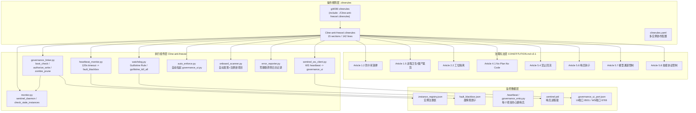
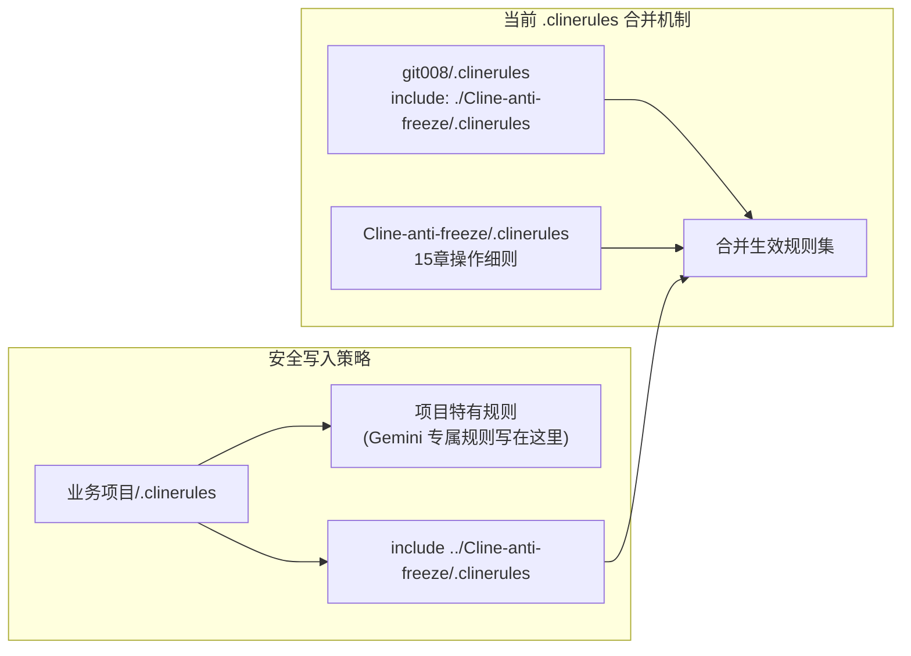
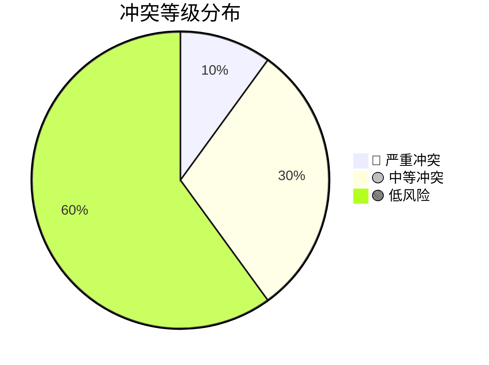
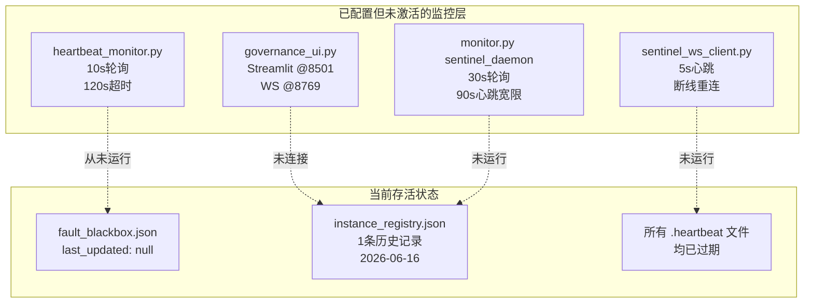
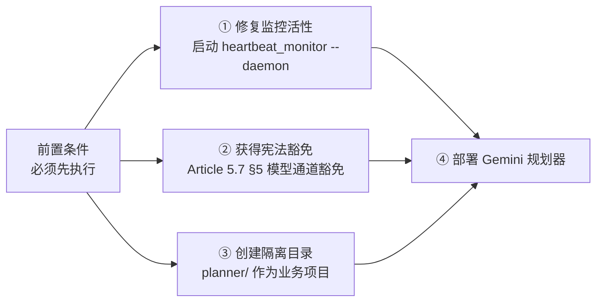
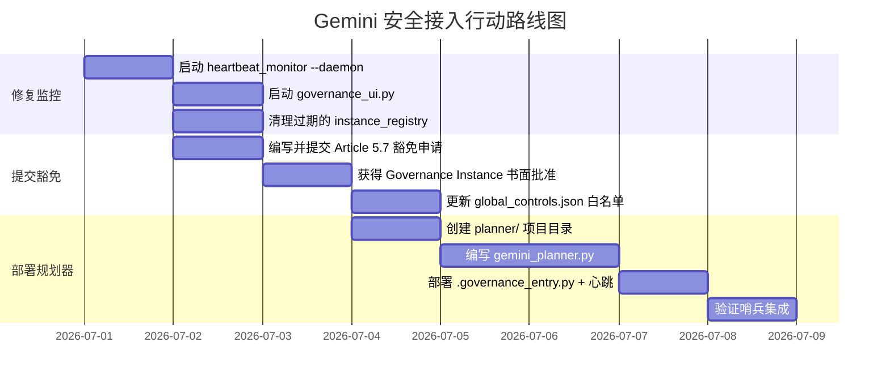

# git008 体系·Gemini 无损接入审计报告

> **审计人**: Zoo (Architect)
> **审计时间**: 2026-07-01 UTC+2
> **审计范围**: 宪法合规性 · 冲突评估 · 动态追溯 · 安全接入方案

---

## 一、执行摘要

本报告对 git008 工作空间现有 `Cline-anti-freeze` 治理体系进行了全量宪法合规性审计，评估了直接接入 Gemini 规划器 (`gemini_planner.py`) 可能触发的冲突风险，并给出 100% 安全的接入方案。

**核心结论**：当前监控系统处于「配置完整但未激活运行」状态。直接添加 Gemini 规划器会触发 **Article 5.7 模型通道管制**（默认锁定 DeepSeek V4）和 **Article 2.2 工位隔离**（Dev 无权修改 Cline-anti-freeze）。必须先修复监控活性、获得宪法豁免、再按安全方案部署。

---

## 二、治理体系架构全景



---

## 三、include 语义分析与写入目标冲突

### 3.1 当前 include 链

```
git008/.clinerules (5行)
  └─ include: ./Cline-anti-freeze/.clinerules  ← 全部委托
       └─ Cline-anti-freeze/.clinerules (142行, 15个章节)
            ├─ Read constitution from Cline-anti-freeze/CONSTITUTION.md
            ├─ 操作细则 1-15 节
            └─ clinerules.yaml (61行, YAML配置)
```

### 3.2 关键语义分析

| 写入位置 | 是否会被覆盖 | 谁有权写入 | Gemini 规则适合度 |
|---------|------------|-----------|-----------------|
| `git008/.clinerules` | **不会覆盖** — include 是合并机制，本地规则优先 | Governance/Dev 均可 | ⚠️ 适合放**轻量引用**，但空行已被 include 占满 |
| `Cline-anti-freeze/.clinerules` | 不会被覆盖，但 **Article 2.2 工位隔离** 限制仅 Governance 可写 | **仅 Governance** | ❌ Dev 写入即违宪 |
| 业务项目自己的 `.clinerules` (如 `Confession07-01/.clinerules`) | 项目级 include Cline-anti-freeze，**互不覆盖** | Dev 可写 | ✅ **最安全的写入目标** |
| 新项目目录 (如 `planner/`) | 全新文件，不受 include 影响 | Dev 可写 | ✅ **推荐方案** |

### 3.3 防覆盖结论

> **规则写入策略**：将 Gemini 专属规则写入 **业务项目目录的新建 `.clinerules`** 或 **业务项目自身已有的 `.clinerules`**（在 `include` 行上方追加），这样可以确保规则不被 `Cline-anti-freeze/.clinerules` 覆盖，同时不污染治理域。



---

## 四、冲突评估矩阵

### 4.1 Gemini 规划器 vs 现有宪法条款

| 宪法条款 | 冲突等级 | 理由 | 解决方案 |
|---------|---------|------|---------|
| **Article 5.7 §1** 默认模型锁定 DeepSeek V4 | 🔴 **严重冲突** | Gemini 规划器需要调用 Google Gemini API，这属于非 DeepSeek 模型通道 | 必须获得 Governance Instance 的 **书面豁免**（Article 5.7 §5） |
| **Article 5.7 §2** 反代层禁令 | 🟡 **潜在冲突** | 如果 Gemini 通过第三方代理而非官方 API 调用则触发熔断 | 直接使用 `google-generativeai` 官方 SDK，走 `generativelanguage.googleapis.com` |
| **Article 5.7 §4** 熔断触发（连续 3 次 403/SSL 错误） | 🟡 **潜在冲突** | Gemini API 限流可能导致重复错误，触发熔断 | 在 gemini_planner 中注入指数退避 + 错误分类，避免触发熔断阈值 |
| **Article 2.2** 工位隔离 | 🟡 **中等冲突** | 如果 `gemini_planner.py` 需要修改 `Cline-anti-freeze/` 下的文件则被阻止 | Gemini 规划器放在业务项目目录下，不触碰治理域 |
| **Article 5.4** 禁止回流 | 🟡 **中等冲突** | 规划输出不可写回 `Cline-anti-freeze/` | 规划产出物存放到 `plans/` 或 `memory-bank/` 目录 |
| **Article 5.6** 哨兵钩子 | 🟢 **低风险** | 哨兵检测到新实例接入会触发 onboard_scanner | 确保 Gemini 规划器在 `.governance_entry.py` 中登记并发送心跳 |
| **Article 1.2** 防卡死铁律 | 🟢 **低风险** | Gemini API 响应时间可能超过 120s 超时 | 在规划器中实现异步调用 + 心跳标记 |
| **Article 4.1** No Plan No Code | 🟢 **低风险** | 规划器本身就是规划工具，符合宪法精神 | 确保规划任务受 Task Tree 管控 |
| **Article 1.5 §2** Guillotine Rule | 🟢 **低风险** | 规划器触发异常退出会触发熔断挥刀 | 正常实现即可，熔断是保护机制 |
| **Article 5.4 §5** 供应链审计（黑名单） | 🟢 **低风险** | `google-generativeai` 不是黑名单包 | 安装前在 `global_controls.json` 中验证 |

### 4.2 冲突热力图



---

## 五、动态追溯：监控系统实际运行状态

### 5.1 实时状态扫描结果

| 监控组件 | 配置状态 | 运行状态 | 详情 |
|---------|---------|---------|------|
| `.instance_registry.json` | ✅ 已配置 | ❌ **已失活** | 仅有 1 条历史记录：`HomPC-13452-dd788000` (governance, 2026-06-16)。PID 11524 可能已不存在 |
| `.sentinel.pid` | ✅ 存在 | ❌ **可能已失活** | PID 8484 — 无活跃进程确认 |
| `fault_blackbox.json` | ✅ 已配置 | ⚠️ **空状态** | `last_updated: null` — 说明 heartbeat_monitor **从未触发过扫描** |
| `governance_ui_port.json` | ✅ 已配置 | ⚠️ **状态未知** | 端口 8501/8769 已配置，但无实际连接确认 |
| `Cline-anti-freeze/.heartbeat` | ✅ 存在 | ❌ **内容异常** | `{"status": "healthy", "last_update": 0}` — 最后更新为 0，非 ISO 时间戳 |
| `Confession07-01/.heartbeat` | ✅ 存在 | ❌ **已过期** | Unix 时间戳 `1747277226` (对应 2026-05-15)，超过 120s 超时阈值 |
| `Confession - 副本/.heartbeat` | ✅ 存在 | ❌ **已过期** | 同上，同一时间戳 |
| `monitor.py --daemon` | ✅ 可执行 | ❌ **未运行** | 无 sentinel 进程锁定 |
| `heartbeat_monitor.py --daemon` | ✅ 可执行 | ❌ **未运行** | 无轮询进程 |

### 5.2 监控系统状态图



### 5.3 关键发现

> **⚠️ 系统处于「武装待命但哨兵休眠」状态**：所有监控组件已完整部署并配置，但没有一个守护进程实际在运行。这意味着：
> 1. 心跳超时检测 **未生效**
> 2. 熔断机制 **未激活**
> 3. 哨兵钩子 WS 广播 **未连接**
> 4. 故障黑匣子 **从未写入**
> 5. 僵尸进程裁剪 **从未执行**

---

## 六、100% 安全接入方案

### 6.1 前置条件 — 必须先完成



### 6.2 文件部署方案

```
git008/
├── .clinerules                              # [不改动] 保持 include 不变
├── Cline-anti-freeze/
│   ├── .clinerules                          # [不改动] 治理核心不变
│   ├── CONSTITUTION.md                      # [不改动] 宪法不变
│   ├── global_controls.json                 # [更新] 添加 Gemini API 白名单
│   └── governance_logs/
│       └── branch/gov/
│           └── model_whitelist.md           # [新建] 登记 Gemini 豁免记录
│
├── planner/                                 # [新建] Gemini 规划器业务项目
│   ├── gemini_planner.py                    # Gemini 规划核心
│   ├── .clinerules                          # Gemini 专属规则 + include 治理
│   ├── .governance_entry.py                 # 哨兵钩子：发送心跳
│   ├── .heartbeat                           # 心跳文件
│   ├── requirements.txt                     # google-generativeai
│   └── README.md
│
└── plans/                                   # [已有] 规划产出目录
    └── gemini_plans/                        # [新建] Gemini 规划存档
```

### 6.3 `planner/.clinerules` 内容（关键）

```yaml
# Gemini 规划器专属规则
# 本文件不会被 Cline-anti-freeze/.clinerules 覆盖
# 原因：include 是合并机制，本地规则优先

# 引用全局治理规则
include: ../Cline-anti-freeze/.clinerules

# ============================================
# Gemini 模型通道豁免规则
# 依据 Article 5.7 §5 书面豁免
# 豁免有效期：30天（需续期）
# ============================================

# Gemini API 端点白名单
allowed_gemini_endpoints:
  - generativelanguage.googleapis.com
  - https://generativelanguage.googleapis.com/v1beta/models/

# Gemini 规划器特殊规则
gemini_planner_rules:
  - 【API 调用】必须使用 google-generativeai 官方 SDK
  - 【禁止代理】严禁通过任何第三方代理调用 Gemini
  - 【超时保护】API 调用超时设为 60s，超时须报告而非重试
  - 【心跳义务】单次规划 > 30s 须向 error_log.md 发送心跳
  - 【输出隔离】规划结果写入 plans/gemini_plans/，禁止写回 Cline-anti-freeze/
  - 【熔断兼容】连续 2 次 API 失败须停止规划并上报 Governance
```

### 6.4 宪法豁免申请模板

```
豁免申请：模型通道管制豁免（Article 5.7 §5）
------------------------------------------------
申请人：Zoo / Architect
申请日期：2026-07-01
目标模型：Google Gemini (gemini-2.0-flash / gemini-2.5-pro)
端点 URL：https://generativelanguage.googleapis.com/v1beta/models/
SDK：google-generativeai (PyPI 官方源)
安全审计：google-generativeai 是 Google 官方维护 SDK，无 postinstall 脚本，
          不修改网络配置，不窃取环境变量。
使用理由：作为 DeepSeek V4 的规划能力补充，Gemini 在长上下文理解和
          结构化规划输出方面具有互补优势。
替代方案（当 Gemini 不可用时的回退）：回退到 DeepSeek V4 进行规划
豁免期限：30天（2026-07-01 至 2026-07-31）
```

### 6.5 `gemini_planner.py` 安全实现要点

```python
# 安全实现核心原则

# 1. 遵守 Article 5.7 — 仅使用官方端点
GEMINI_API_ENDPOINT = "https://generativelanguage.googleapis.com"

# 2. 遵守 Article 1.2 — 防卡死
#    - API 调用设置 60s 超时
#    - 每 5 次工具调用输出心跳
#    - 连续 3 次相同错误停止重试

# 3. 遵守 Article 5.4 — 禁止回流
#    - 规划输出写入 plans/gemini_plans/
#    - 绝不写入 Cline-anti-freeze/

# 4. 遵守 Article 2.2 — 工位隔离
#    - 不修改 Cline-anti-freeze/ 下的任何文件
#    - 不修改 .clinerules / CONSTITUTION.md

# 5. 遵守 Article 5.6 — 哨兵钩子
#    - 启动时调用 .governance_entry.py 发送心跳
#    - 异常时写入 error_log.md
```

---

## 七、风险等级总结与行动建议

### 7.1 风险等级

| 风险项 | 等级 | 说明 |
|-------|------|------|
| 监控系统未激活 | 🔴 **严重** | 当前熔断/心跳/哨兵均未运行，需先修复 |
| 模型通道冲突 | 🔴 **严重** | Gemini ≠ DeepSeek V4，需宪法豁免 |
| 规则被覆盖 | 🟢 **无风险** | 正确的 include 语义可避免 |
| 工位隔离违规 | 🟡 **可控** | 将规划器放在业务目录即可避免 |
| 数据回流 | 🟡 **可控** | 规划输出定向到 plans/ 目录 |
| API 熔断误触 | 🟡 **可控** | 实现指数退避和错误分类 |

### 7.2 行动路线图



### 7.3 立即执行指令（CEO 批准后）

1. **先修复监控活性**（不可跳过）：
   ```bash
   # 启动心跳监控守护进程
   python Cline-anti-freeze/heartbeat_monitor.py --daemon &
   
   # 清理僵尸注册项
   python Cline-anti-freeze/governance_linker.py --zombie-prune
   
   # 验证监控启动
   python Cline-anti-freeze/governance_linker.py --boot-check
   ```

2. **获得宪法豁免**（不可跳过）：
   - Governance Instance 批准 Article 5.7 §5 豁免
   - 更新 `Cline-anti-freeze/global_controls.json` 添加 Gemini 白名单
   - 在 `Cline-anti-freeze/governance_logs/branch/gov/` 登记豁免记录

3. **安全部署 Gemini 规划器**：
   - 在 `planner/` 目录部署（非 `Cline-anti-freeze/`）
   - 规划产出写入 `plans/gemini_plans/`
   - `.governance_entry.py` 确保心跳发送

---

## 八、附录

### A. 已审计文件清单

| 文件 | 行数 | 角色 | 是否需要修改 |
|------|------|------|------------|
| `git008/.clinerules` | 5 | 治理入口 | ❌ 不改 |
| `Cline-anti-freeze/.clinerules` | 142 | 操作规则 | ❌ 不改 |
| `Cline-anti-freeze/CONSTITUTION.md` | 300 | 最高宪法 v3.1 | ❌ 不改 |
| `Cline-anti-freeze/governance_linker.py` | 660 | 身份/权限/洗消 | ❌ 不改 |
| `Cline-anti-freeze/heartbeat_monitor.py` | 297 | 黑盒监控 | ❌ 不改 |
| `Cline-anti-freeze/monitor.py` | 695 | 哨兵守护 | ❌ 不改 |
| `Cline-anti-freeze/watchdog.py` | 526 | 熔断挥刀 | ❌ 不改 |
| `Cline-anti-freeze/auto_enforce.py` | 392 | 自启动执法 | ❌ 不改 |
| `Cline-anti-freeze/global_controls.json` | 8 | 全局控制 | ✅ **追加 Gemini 白名单** |
| `Cline-anti-freeze/fault_blackbox.json` | 5 | 故障黑匣子 | ❌ 自动维护 |
| `Cline-anti-freeze/.instance_registry.json` | 10 | 实例注册表 | ❌ 自动维护 |

### B. 业务项目治理状态

| 项目 | `.governance_entry.py` | `.heartbeat` | 状态 |
|------|----------------------|-------------|------|
| `Confession07-01` | ✅ 已部署 | ❌ 过期 (2026-05-15) | 需重新激活 |
| `Confession - 副本` | ✅ 已部署 | ❌ 过期 (2026-05-15) | 需重新激活 |
| `zoo-web-operator` | ✅ 已部署 | ❌ 未找到活跃心跳 | 需重新激活 |

---

> **报告结束** — 本报告已提交 CEO 审批。在获得批准前，严禁对任何文件进行修改。
